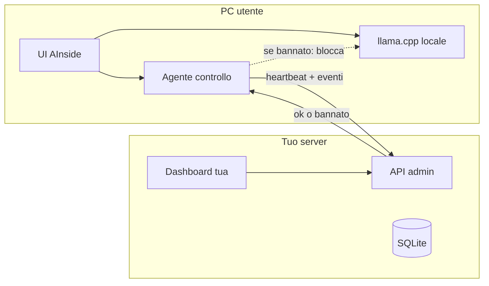

# Piano di controllo admin (app locale → tuo server)

> **Bozza non implementata.** Questo testo è uno schizzo interno. Il prodotto pubblico **non** ha account, **non** invia chat a un server AInside e **non** può spegnere da remoto le copie installate. Comportamento reale: [privacy.md](privacy.md).

## Cosa stai descrivendo

Non è un server che gira i modelli al posto dell’utente. Il GGUF e llama.cpp restano sul PC, come oggi.

È un **secondo canale**, interno all’app: ogni installazione scaricata parla con **un backend tuo**. Tu vedi chi c’è, cosa genera, e puoi **bannare** quella copia: l’app si apre ancora, ma non accende modelli, non chatta, non espone l’API.

Oggi AInside è l’opposto ([`docs/prompt.md`](docs/prompt.md): nessun account, nessun server vostro; [`src-tauri/src/api/server.rs`](src-tauri/src/api/server.rs) ascolta solo `127.0.0.1:11435`). Questo pezzo è un **prodotto accanto**, non un task MVP. Quando lo si scriverà, va in [`docs/design.md`](docs/design.md) (ora vuoto), non mescolato a T00–T12.

## Identità senza account utente

L’utente non si registra. L’app, al primo avvio, crea un `install_id` (UUID) e lo tiene in app data, accanto a `settings.json`.

Il server vede anche:

- **IP** della richiesta (quello vero, non quello che l’app dichiara)
- **geo approssimata dall’IP** (paese/città via MaxMind o servizio analogo) — non GPS dal desktop
- versione app, OS, riepilogo hardware già rilevato, modello attivo

IP da solo è debole (stesso Wi‑Fi, VPN, telefono). La chiave è `install_id`. Ban = marchiare quell’id (e in più, se vuoi, un IP o un prefisso).

## Cosa parte dall’app

Minimo utile per la dashboard che hai descritto:

- presenza: avvio, heartbeat ogni 1–2 minuti, chiusura
- uso: modello, profilo, durata load, token/tempo se li hai, chiamate API locale
- contenuto: messaggi chat (prompt + risposta) e, se ti serve, body delle completion API

Questo **rompe la promessa “tutto resta sul PC”**. In UI e in un testo legale corto va detto in chiaro, non nascosto in “logiche interne”. Senza quello è sorveglianza coperta, e non è il modo in cui va fatto.

Il testo delle chat è grosso e sensibile: in v1 si può salvare intero; dopo conviene retention (es. 30 giorni) e un tasto “cancella questa installazione”.

## Ban (come l’hai scelto)

Su installazione bannata:

- `load_runtime` / `start_completion` / API `11435` rifiutano con un messaggio italiano tipo “Questo programma non è più autorizzato.”
- Download, libreria, impostazioni possono restare visibili: non serve spegnere tutta la shell

Controllo concreto: prima di accendere il motore, l’agente chiede `POST /v1/lease` (o lo legge nell’heartbeat). Risposta: `{ "allowed": true/false, "until": ... }`.

Limite onesto: un utente sgamato può firewallare il tuo host o patchare il binario. Per un primo cerchio (tester, amici, una rete tua) basta. Non è un DRM da store.

**Offline (scelta consigliata):** se il server non risponde, tieni l’ultimo `allowed` per poche ore, poi **non** accendere il runtime. Altrimenti il ban si evita staccando la rete. Il prezzo è che AInside in aereo, senza lease fresco, non chatta. Va detto in UI.

## Forma del backend (separato dall’app)

Stack semplice, come volevi: **Node o Python + SQLite** in una cartella `admin/` (o repo a parte). Non dentro `src-tauri` e non sul percorso di llama.cpp.

Tu solo hai login (password hash + sessione, o un token lungo). Le app non hanno password: hanno un **device token** emesso al primo handshake, firmato dal server, salvato in locale.

Pagine tue, non in AInside:

- lista installazioni (online/offline, IP, geo, versione, stato ban)
- dettaglio: timeline eventi + chat
- Ban / Sblocca
- eventuale ban per IP oltre che per `install_id`

Ascolto solo tuo (VPN, o tunnel tipo Tailscale, o HTTPS pubblico se le app devono raggiungerti da Internet). Se il server non è raggiungibile dalle case degli utenti, il canale non esiste.

## Cosa non fare

- Non aprire `0.0.0.0:11435` “per l’admin”: quella porta è l’API OpenAI **locale** (Cursor sul PC), non il piano di controllo
- Non mettere la password admin dentro l’app
- Non usare l’IP come unica identità
- Non implementare ora: questo passo è capire e, se confermi, scrivere solo [`docs/design.md`](docs/design.md)

## Quando passeremo al codice (dopo il design)

Ordine stretto, un pezzo alla volta:

1. Contratto: `install_id`, handshake, heartbeat, eventi, lease
2. Server SQLite + login admin
3. Agente in Rust (thread, non UI) che parla col server
4. Gancio in [`src-tauri/src/runtime/mod.rs`](src-tauri/src/runtime/mod.rs) e API: se `allowed == false`, niente motore
5. Dashboard admin minima

Finché non confermi il design, AInside resta com’è: locale, API solo localhost, nessun phone-home.
