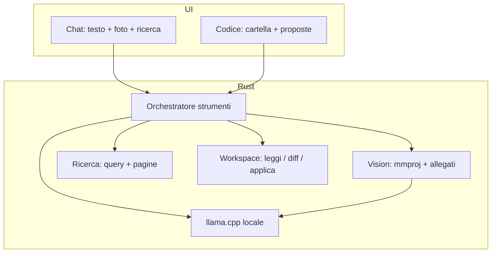
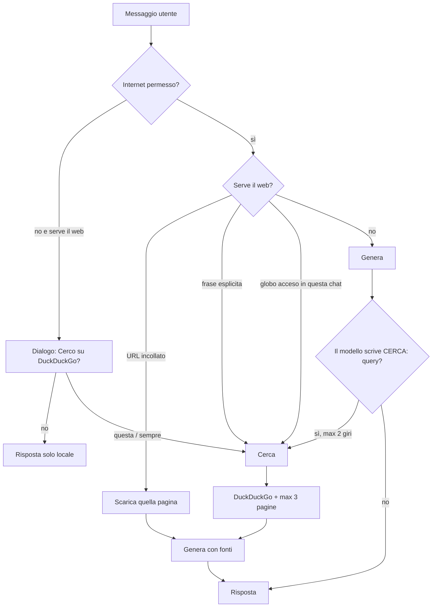

# Piano: immagini, ricerca, modalità codice

**Aggiornamento:** Codice ha un piano proprio, più stretto: [`plan-coding.md`](plan-coding.md). **Ricerca e visione sono in pausa** — non si implementano insieme al codice. Questo file resta come contesto; in caso di conflitto vince `plan-coding.md`.

Disegno originario (architettura). Le tre cose condividono un piano; non sono tre app.

Oggi AInside è chat di testo su llama.cpp: un messaggio = una stringa ([`src-tauri/src/chat/types.rs`](src-tauri/src/chat/types.rs), [`src/views/ChatView.tsx`](src/views/ChatView.tsx)). Il catalogo ha già categorie `visione` e `programmazione` e punteggi `quality.coding`, ma nessun file mmproj, nessun allegato, nessuna cartella di lavoro. [`docs/tasks.md`](docs/tasks.md) le metteva in «dopo l’MVP».

Principio invariato ([`docs/prompt.md`](docs/prompt.md)): *«Dimmi cosa vuoi fare. Al resto pensa il software.»* L’utente non sceglie GGUF, tool-calling o projector. Vede un posto chiaro e un esito.



---

## Scelte di prodotto (bloccate)

1. **Due superfici.** Immagini e ricerca restano **dentro la chat**. **Codice ha un tasto dedicato in sidebar** e una vista sua (albero + conversazione + scritture). Non è un clone di Cursor/VS Code.
2. **Strumenti orchestrati dall’app**, con un canale stretto per il modello. Niente JSON tool-calling OpenAI in v1: i locali lo sbagliano. L’app decide i casi sicuri; il modello può *chiedere* un’azione con una riga fissa (`CERCA:` / `SCRIVI:`), che Rust esegue o rifiuta.
3. **Immagini = capire foto**, non generarle.
4. **Ricerca v1 = DuckDuckGo**, zero chiavi. Se chiedi di cercare su Internet, **succede**: non dipende dal globo acceso. Permesso Internet: alla prima volta si chiede; puoi dire «sempre».
5. **L’agente può scrivere sul disco** se ha il permesso. Default: chiede. Puoi dare **sempre in questa cartella** (o sempre ovunque, con conferma extra). I file-segreto (`.env`, chiavi) chiedono **ogni volta**, anche con permesso permanente.

---

## Fondazione (prima di tutto)

Senza questo, le tre feature si pestano i piedi.

### Messaggi oltre il testo

`ChatMessage` diventa:

- `content` (testo, come oggi)
- `attachments[]`: `{ kind: image | page | file, id, name, mime? }`
- i binari **non** stanno nel JSON delle chat: file in `{appData}/chats/{sessionId}/media/`

`ChatSession` prende:

- `kind`: `chat` | `code` (default `chat`)
- `workspacePath?` solo per `code`
- `searchEnabled?` per sessione (oltre al master in Impostazioni)

`ChatTurn` verso llama.cpp resta testo +, se c’è visione, parti immagine in formato OpenAI (`image_url` data URI o path che il server accetta). Il frontend non calcola compatibilità né packing: chiede a Rust.

### Orchestratore

Modulo nuovo `src-tauri/src/capability/`:

- `vision/` — salva/ridimensiona allegati, sa se il modello ha mmproj
- `search/` — query, fetch, estratto
- `workspace/` — lista/leggi/diff/applica sotto una root
- `pack.rs` — entra nel context senza farlo scoppiare (stima già in [`runtime/config.rs`](src-tauri/src/runtime/config.rs))

Un giro:

1. UI manda intento (testo, foto, «cerca», «apri cartella», file citati)
2. Rust raccoglie fonti (immagini già sul disco, risultati web, file letti)
3. Costruisce i messaggi per llama.cpp
4. Stream come oggi
5. Se il modello ha proposto una patch, Rust la parsa e la UI la mostra come carta, non come muro di markdown

### UI comune

Composer della chat: testo + due azioni che **compaiono solo se ha senso**:

- graffetta / trascina / incolla — se il modello è in categoria `visione` **e** c’è mmproj
- globo — se in Impostazioni è permesso Internet

Niente quarto e quinto bottone «esperto». Se manca la capacità: messaggio italiano («Questo modello non vede le foto. Ti consiglio …») e scorciatoia a Modelli.

Sidebar: **Codice** è una voce di primo livello, accanto a Chat / Modelli. Immagini e Ricerca non hanno voce propria. Quando si implementa T17, aggiornare [`docs/design.md`](docs/design.md) (lista sidebar + layout Codice).

---

## 1. Immagini (visione)

### Cosa vede l’utente

In chat: allega una o più foto (file, drag, Ctrl+V). Miniature sopra il composer. In bolla: foto + domanda. Risposta in italiano, come oggi.

Se il modello non vede: la graffetta non c’è, o spiega e propone un modello `visione` che sta sul PC ([`compatibility`](src-tauri/src/compatibility/engine.rs)).

### Cosa deve fare il software

Il catalogo oggi marca `visione` ma scarica solo il GGUF testo. llama.cpp per vedere ha bisogno del **mmproj** (`--mmproj`) accanto a `-m`.

- Catalogo: su ogni modello visivo, blocco `vision: { filename, url, sha256, sizeBytes }` verificato su Hugging Face come le altre varianti (`updatedAt`).
- Download: se l’utente scarica un modello visivo, si prende anche il projector (progresso unico: «Modello + visione»).
- Runtime ([`process.rs`](src-tauri/src/runtime/process.rs)): se esiste mmproj, avvialo. Stima VRAM/RAM include il projector. Senza file: il modello parte in sola chat, graffetta nascosta.
- API locale `11435`: accettare `image_url` come OpenAI, così Cursor/script possono mandare foto allo stesso motore.

Limiti v1: jpeg/png/webp, max ~4 foto a messaggio, resize lato Rust (lato lungo ~1280) per non esplodere il context. Niente PDF, niente video.

---

## 2. Ricerca web

Motore v1: **DuckDuckGo HTML** (nessuna chiave, nessuna Brave in v1). Solo query + URL delle pagine; la cronologia chat non esce.

### Il problema

Se aspetti che il modello «chiami un tool» in JSON, Gemma/Qwen spesso non lo fanno, o lo inventano. Se cerchi **ogni** messaggio, «buonasera» finisce su Internet. Se c’è solo il globo, l’utente deve ricordarsi di accenderlo: non è «dimmi cosa vuoi fare».

### Modo migliore: tre vie, stesso motore



**Via 1 — l’utente lo chiede (non dipende dal modello).** Rust riconosce l’intento in italiano/inglese, es. «cerca su internet», «cerca online», «google», «ultime notizie su», «che si sa oggi di». In modalità Codice, «cerca nel file / nella cartella» **non** è web. Query = resto della frase, pulita. Poi DDG, poi il modello risponde con le fonti.

**Via 2 — il modello se ne accorge.** System prompt corto: se ti serve il web e non hai fonti, scrivi **una riga sola** `CERCA: query` e nient’altro. Rust intercetta (anche a metà stream), ferma, cerca, re-inietta le fonti, secondo giro. Massimo **due** ricerche a messaggio, poi risponde con quello che ha. Niente JSON, niente function-calling llama.cpp in v1.

**Via 3 — globo in quella chat.** «In questa conversazione usa Internet quando serve» (default: spento). Utile se fai una serie di domande di attualità. Non è obbligatorio per la via 1.

**Via 0 — link.** Se c’è un `http(s)://…` nel messaggio, Rust scarica quella pagina. Sempre, anche senza «cerca».

### Permesso Internet (come le scritture)

Default: **chiedi**. Prima volta che scatta via 1/2/3:

> Per rispondere cerco su Internet con DuckDuckGo. La domanda esce dal computer.

- Solo questa volta
- Sempre (salva `internet: always` in Impostazioni)
- No → risposta locale + «Posso rispondere solo con quello che so già.»

Impostazioni → Privacy: `chiedi` | `sempre` | `mai`. «Mai» spegne anche il marker `CERCA:`.

In chat, mentre cerca: riga di stato «Cerco su Internet…» e poi i chip fonte sotto la risposta (titolo + sito veri, non link inventati).

Limiti: timeout, user-agent AInside, niente login/cookie. Non è un browser. Offline: stesso messaggio italiano.

---

## 3. Modalità codice

Non è la chat con un system prompt «sei un programmatore». È un **posto** (tasto sidebar **Codice**) con cartella, file e un agente che può **scrivere** se glielo permetti.

### UX

Empty state:

> Apri una cartella del computer. Il modello legge i file. Per modificarli ti chiede il permesso — puoi darglielo anche per sempre, su questa cartella.

Layout (token di [`design.md`](docs/design.md): surface, bordi bassi, niente dashboard):

```
┌────────────┬─────────────────────────────┐
│ Progetto   │ Conversazione               │
│ albero     │ + carte modifica            │
│ file       │   scritte o in attesa ok    │
│            │                             │
│            ├─────────────────────────────┤
│            │ Composer: cosa vuoi fare    │
│            │ @file per citare            │
└────────────┴─────────────────────────────┘
```

- Sinistra ~240px: albero, ignora `node_modules`, `.git`, `dist`, binari.
- Centro: chat. I diff sono carte con path e +/- , non un muro da copiare.
- Clic su un file: anteprima sola lettura in v1. Niente IDE.
- Header: cartella, modello, «Stato locale», badge permesso (`Chiede` / `Può scrivere qui`). Se `quality.coding < 4`: «Per il codice va meglio {nome}. Usarlo?»
- Sidebar **Codice**: «Nuova» = sessione `kind: code`, separata dalle chat.

Copy: «Ho letto 4 file. Scrivo `app.ts`.» oppure «Aspetto il permesso per scrivere `app.ts`.»

### Permessi di scrittura (anche definitivi)

Aprire la cartella = **solo lettura**. La scrittura è un permesso a parte, salvato in `settings.json`, revocabile da Impostazioni → Codice.

| Livello | Significato |
| --- | --- |
| `ask` | Default. Prima di ogni batch di file: dialogo. |
| `session` | Sì fino a chiusura app / cambio cartella. Non sopravvive al riavvio. |
| `folder` | **Definitivo su quella root.** L’agente applica subito. In lista «Cartelle fidate». |
| `always` | Definitivo su **ogni** cartella che apri. Seconda conferma: «Potrà modificare qualsiasi progetto che apri qui.» |

Dialogo (quando è `ask`):

> Il modello vuole modificare 2 file in `Documenti\progetto`.

- Solo questi, questa volta
- Sempre in questa cartella → `folder`
- Non ora

Con `folder` o `always`: applica da solo, toast «Ho scritto `app.ts`» + **Annulla** (tiene l’ultimo snapshot per file, una volta). La carta resta in chat come cronologia, già applicata.

**Mai coperti dal permanente** (chiedono sempre): `.env`, `*.pem`, `id_rsa`, `credentials.json`, e qualsiasi path fuori dalla root. Path traversal = errore, non dialogo.

Stesso schema del permesso Internet: tre parole in UI (`Chiedi` / `Sempre qui` / `Sempre`), niente gergo ACL.

### Strumenti v1

Tutto sotto la root. Elenco / cerca nel progetto **non** è DuckDuckGo.

| Strumento | Chi lo lancia | Effetto |
| --- | --- | --- |
| Apri cartella | utente | `workspacePath` + lettura |
| Elenca / cerca file | app | lista o hit, tagliati |
| Leggi file | app | context, cap ~64 KB/file |
| Proponi / scrivi | modello → parse Rust | se permesso ok: write atomico; se `ask`: carta in attesa |
| Annulla ultima | utente | ripristina snapshot |

Il modello non ha una shell. Marker opzionale `SCRIVI:` + blocco diff, stesso stile di `CERCA:`: una forma sola, Rust parsa. Se non è parsabile, resta testo.

### Strumenti dopo (non in v1)

- Terminale con conferma («Eseguo `npm test`?») — stesso sistema permessi (`ask` / `session` / `folder`)
- Git: stato / diff come contesto; commit solo se lo chiedi
- Tool-calling nativo llama.cpp, più avanti

### Runtime

Stesso llama.cpp. Prompt corto:

> Sei {nome}. Lavori nella cartella aperta. Non inventare file che non hai letto. Se devi modificare, proponi un diff piccolo. Se ti serve il web, una riga `CERCA: query`.

Context: albero corto + file citati/aperti + domanda. Se non ci sta, Rust toglie i file meno recenti, poi accorcia.

---

## Ordine di lavoro

Un pezzo alla volta, progetto compilabile, come in [`docs/tasks.md`](docs/tasks.md).

| Task | Cosa lascia |
| --- | --- |
| **T13** Fondazione | `kind`, allegati su disco, `capability/` vuoto ma agganciato, messaggi vecchi ancora validi |
| **T14** Visione catalogo + download | mmproj nel catalogo, download accoppiato, stima spazio/VRAM |
| **T15** Visione runtime + chat | `--mmproj`, graffetta, stream con foto, API `image_url` |
| **T16** Ricerca | DDG; intento utente + `CERCA:` + globo; permesso chiedi/sempre/mai; fonti in UI |
| **T17** Codice — guscio | tasto sidebar, empty, albero, sessione `code` |
| **T18** Codice — lettura | leggi/cerca in cartella, packing, prompt codice |
| **T19** Codice — scrittura | diff, permessi `ask`/`session`/`folder`/`always`, applica + annulla |

## Ordine di lavoro

Superato. L’ordine attuale è solo Codice: T13–T16 in [`plan-coding.md`](plan-coding.md) e [`tasks.md`](tasks.md). Visione e ricerca non partono da qui.

---

## Fuori scope (finché non c’è un task)

- Generare immagini
- Video / PDF come «visione»
- Browser agent, account, server vostro per l’inferenza
- IDE (Monaco, LSP, debugger, tab infinite)
- Terminale / git (stesso schema permessi, task dopo T19)
- Altri OS first-class (la struttura può restare Windows-first)
- Piano admin ([`docs/plan-admin.md`](docs/plan-admin.md)): canale a parte, non mescolarlo qui

---

## Stato del disegno

Codice: vedi [`plan-coding.md`](plan-coding.md). Ricerca e visione: in pausa.

**Nessun codice finché non dici di partire da T13 (guscio Codice).**
