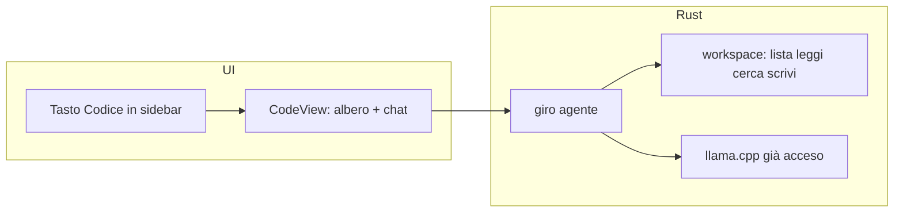
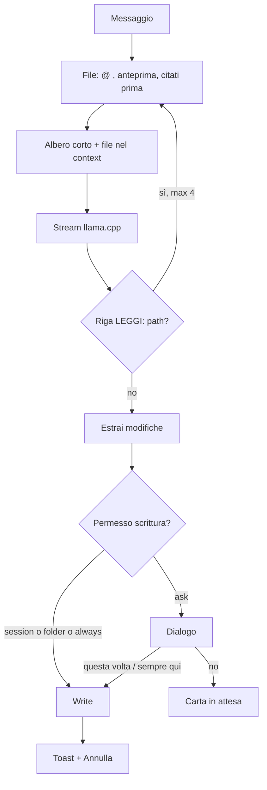

# Piano: modalità Codice

Solo questa modalità. Ricerca web e visione restano parcheggiate in [`plan-capability.md`](plan-capability.md): **non** entrano in questi task.

AInside oggi è chat di testo ([`ChatView.tsx`](../src/views/ChatView.tsx), [`chats.json`](../src-tauri/src/chat/mod.rs), llama.cpp). Non vede il disco del progetto. La cartella si può già scegliere ([`pickFolder.ts`](../src/lib/pickFolder.ts)); il frontend **non** ha permesso `fs` ([`capabilities/default.json`](../src-tauri/capabilities/default.json)). Giusto: lista, lettura e scrittura passano da Rust.

Principio: *«Dimmi cosa vuoi fare.»* Non è Cursor. Niente IDE, niente Internet. Cartella aperta, conversazione, file, e comandi nella stessa cartella se hai dato il permesso.



---

## Cosa è / cosa non è

**È:** un posto in AInside in cui apri una cartella del PC, parli col modello locale, lui legge i file e può modificarli.

**Non è:** un editor con tab, LSP, git, test runner, browser, ricerca web, visione. Quei pezzi, se arriveranno, hanno task propri.

---

## Scelte (bloccate)

1. **Tasto dedicato in sidebar**, etichetta «Codice», stesso peso di «Nuova chat» (riga intera, non quinta iconcina nel rail da 232px: non ci sta accanto al brand).
2. **Vista propria** `CodeView`, route `code`. Non un flag su `ChatView`.
3. **Stesso motore** già acceso. Non si ricarica il GGUF passando da Chat a Codice.
4. **Disco solo in Rust** (`src-tauri/src/workspace/`). UI manda path logici; Rust rifiuta tutto fuori dalla root.
5. **L’app orchestra**; il modello può chiedere file con una riga `LEGGI: percorso`. Niente JSON tool-calling.
6. **Scrittura con permessi**, anche definitivi sulla cartella. `.env` e chiavi: chiedono sempre.
7. **Niente rete** in questi task. «Cerca» = nel progetto, non DuckDuckGo.

---

## UX

### Sidebar ([`Sidebar.tsx`](../src/layout/Sidebar.tsx))

Oggi: icone Home / Modelli / Download / Impostazioni, poi **Nuova chat**, poi l’elenco.

Aggiungere sotto Nuova chat:

```
+ Nuova chat
  Codice
```

- Clic **Codice** → `route = code`. Se non c’è una sessione `kind: code` corrente, empty state (non creare una sessione vuota in elenco finché non apri una cartella o mandi un messaggio).
- In `code`, l’elenco mostra solo sessioni codice; in `chat`, solo le chat (le vecchie senza `kind` = chat).
- In `code`, il bottone plus diventa **Nuovo lavoro** (nuova sessione codice).
- Icona: `IconCode` già c’è in [`icons.tsx`](../src/ui/icons.tsx).
- Aprire una riga codice → CodeView; una chat → ChatView.

Quando si implementa: aggiornare [`design.md`](design.md) (sidebar: Nuova chat, Codice, …).

### CodeView

Empty, nessuna cartella:

> Apri una cartella del computer. Il modello legge i file. Per modificarli ti chiede il permesso — puoi darglielo anche per sempre, su questa cartella.

Tasto: **Apri cartella** (`pickFolder`).

Con cartella:

```
┌──────────────┬─────────────────────────────────┐
│ header: nome cartella · modello · locale     │
│ permesso: Chiede | Può scrivere qui          │
├──────────────┼─────────────────────────────────┤
│ Albero       │ Conversazione                   │
│ ~240px       │ carte modifica (attesa/scritte) │
│              ├─────────────────────────────────┤
│              │ @file · Scrivi qui.             │
└──────────────┴─────────────────────────────────┘
```

- Albero: cartelle pieghevoli, niente `node_modules`, `.git`, `dist`, `target`, `.venv`. Click file → anteprima **sola lettura** a destra (sostituisce il vuoto, non un IDE).
- Se `quality.coding < 4` sul modello attivo: alert «Per il codice va meglio {nome}. Usarlo?» con scorciatoia a Modelli.
- Composer: come la chat (textarea, Invia/Stop, thinking se acceso). In più `@` apre file del progetto (comando Rust di ricerca path).
- Stato mentre lavora: «Leggo `app.ts`…» / «Scrivo `app.ts`…» / generazione come oggi.

Copy italiano, zero GGUF.

---

## Dati

Estendere sessioni esistenti (JSON vecchio resta valido: campi assenti = chat).

`ChatSession`:

- `kind`: `"chat"` | `"code"` (default `"chat"`)
- `workspacePath`: `string | null`

`create_chat` accetta `kind` (e path se già scelto). Titolo codice: nome cartella, poi prima domanda.

`AppSettings` (nuovo blocco, default sicuro):

```
coding: {
  write: "ask",                  // ask | always
  trustedFolders: ["D:\\proj"],  // livello folder
  lastWorkspace: "..."           // per riaprire in un click, non è un permesso
}
```

`session` non si salva: vive in RAM finché l’app è aperta.

Messaggi: per v1 restano `{ role, content, durationMs }`. I path letti e i diff applicati stanno nel testo della carta / in un campo opzionale `patches[]` sulla risposta assistant, se serve alla UI. Non duplicare i file del progetto in `appData`.

---

## Rust: `workspace/`

Comandi Tauri (errori in italiano):

| Comando | Fa |
| --- | --- |
| `workspace_tree(root)` | albero tagliato (profondità e n. nodi max) |
| `workspace_read(root, rel)` | testo, cap 64 KB; binario → errore chiaro |
| `workspace_search(root, query)` | path e/o contenuto, ignore + cap hit |
| `workspace_apply(root, edits)` | write atomico (tmp + rename) se permesso ok |
| `workspace_undo(root)` | ultimo batch di questa sessione |
| `coding_grant` / `coding_revoke` | aggiorna settings |

Regole fisse:

- Ogni path risolto deve stare **dentro** `root` (niente `..`).
- Segreti (`.env`, `.env.*`, `*.pem`, `id_rsa`, `credentials.json`, `*.pfx`): lettura consentita solo se citati esplicitamente; **scrittura sempre `ask`**.
- Ignore: lista interna + `.gitignore` se c’è, senza diventare un client git.

Niente plugin `fs` nel frontend.

---

## Giro agente (un messaggio utente)

Niente ricerca web. Stesso `start_completion` / stream di oggi, con prompt e contesto diversi.



**Pack.** Budget = context del runtime (se non è nello snapshot, usiamo il valore di config già calcolato al load). Stima grezza caratteri/3. Ordine: system corto → albero (nomi) → file @ e aperti (più recenti prima) → cronologia già strip-think → domanda. Se non ci sta, si tolgono file, non la domanda.

**Prompt** (corto, nome dal catalogo come in chat):

> Sei {nome}. Lavori solo nella cartella aperta. Non inventare file che non hai letto. Se ti manca un file, una riga `LEGGI: percorso/relativo`. Per modificare: blocchi cerca/sostituisci, non riscrivere il file intero se basta un pezzo.

**`LEGGI:`** — Rust intercetta a fine risposta (o a riga completa), legge, secondo giro. Max 4 letture a messaggio, poi risponde con quello che ha. Path fuori root o ignore → in italiano, niente retry infinito.

**Formato modifica** (uno, i locali lo sbagliano meno del diff unificato):

```
*** File: src/app.ts
<<<
pezzo vecchio esatto
>>>
pezzo nuovo
```

Più blocchi = più file. Se il vecchio non matcha, carta errore «Non trovo quel pezzo in `app.ts`.» — niente write parziale silenziosa. Fallback: se il file è corto e arriva un fence ` ```app.ts ` con il file intero, si accetta come sostituzione totale.

UI: ogni file è una **carta** (path, +/- , stato). Non un muro di markdown da copiare.

---

## Permessi di scrittura

Aprire la cartella = **lettura**. Scrivere è altro.

| Livello | Dove vive | Effetto |
| --- | --- | --- |
| `ask` | default | dialogo prima di ogni batch |
| `session` | RAM | sì fino a chiusura app o cambio cartella |
| `folder` | `trustedFolders` | definitivo su quella root |
| `always` | `coding.write` | definitivo su ogni cartella aperta; **seconda** conferma |

Dialogo:

> Il modello vuole modificare 2 file in `Documenti\progetto`.

- Solo questi, questa volta
- Sempre in questa cartella
- Non ora → carta in attesa, Applica dopo

Con `folder` / `always` / `session`: applica e toast «Ho scritto `app.ts`» + **Annulla** (uno snapshot per file, un livello). Header: badge `Chiede` / `Può scrivere qui`.

Impostazioni → Codice: elenco cartelle fidate, togli, torna a «Chiedi». `always` si toglie da lì.

Fuori root = errore, non dialogo.

---

## File previsti (quando si implementa)

Non toccarli ora. Mappa per non sparpagliare:

- `src-tauri/src/workspace/` — nuovo
- `src-tauri/src/chat/types.rs`, `mod.rs` — `kind`, `workspacePath`, `create_chat`
- `src-tauri/src/settings/mod.rs` — blocco `coding`
- `src-tauri/src/runtime/mod.rs` — giro `LEGGI:` + pack (o comando `start_coding_turn` che riusa `complete`)
- `src/views/CodeView.tsx` + `src/views/code/*` — albero, carta, anteprima
- `src/layout/Sidebar.tsx`, `AppShell.tsx`, `navigation/routes.ts`
- `src/styles/views.css` — layout due colonne, niente vetro extra
- `docs/design.md` — una riga sidebar

Riuso: `useRuntime`, `ChatMessage`, `Markdown`, `pickFolder`, dialog/toast già in `src/ui`.

---

## Ordine task

Un pezzo alla volta, compilabile, **senza** visione e **senza** ricerca.

| Task | Lascia |
| --- | --- |
| **T13** Guscio | route `code`, tasto Codice, elenco filtrato, empty + `pickFolder`, sessione `kind` + path. Niente letture file, niente modello sul disco del progetto. |
| **T14** Disco in lettura | `workspace_tree` / `read` / `search`, albero e anteprima, `@` nel composer. |
| **T15** Giro | pack + prompt codice + `LEGGI:` (max 4) + stream nella CodeView. Ancora niente write. |
| **T16** Scrittura | parse blocchi, permessi, apply, undo, carte. |

T13 non anticipa il parser dei diff. T15 non scrive. T16 è l’unico che tocca il disco in scrittura.

---

## Fuori da T13–T16

- DuckDuckGo / globo / `CERCA:`
- mmproj, graffetta, foto
- Git, LSP, Monaco
- Agente che lancia comandi da solo (arriva in T20, con conferma)
- Plugin `fs` nel frontend
- Secondo processo llama.cpp

---

## Stato

T13–T18 fatti: guscio, lettura, giro agente, scrittura con permessi, terminale con comandi nella cartella. Visione e ricerca web restano in pausa.

Fase 6 (terminale nella cartella, non un IDE):

| Task | Lascia |
| --- | --- |
| **T17** Guscio terminale | pannello in basso, apri/chiudi. Nessun processo. |
| **T18** Comandi | spawn nella root, stream, stop, permessi come write. |
| **T19** Installa / Avvia | `package.json` + node/npm, processo lungo. |
| **T20** Proponi comando | `ESEGUI:` + conferma. Il modello non lancia da solo. |
